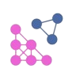

<!-- Improved compatibility of back to top link: See: https://github.com/othneildrew/Best-README-Template/pull/73 -->

<!-- PROJECT LOGO -->

  
  <h1 align="center">Offboard StudioApp</h1>

<!-- TABLE OF CONTENTS -->

  
Table of Contents

  <ol>
    <li>
      <a href="#about-the-project">About The Project</a>
    </li>
    <li>
      <a href="#getting-started">Getting Started</a>
      <ul>
        <li><a href="#prerequisites">Prerequisites</a></li>
      </ul>
    </li>
    <li><a href="#usage">Usage</a></li>
  </ol>

 

<!-- ABOUT THE PROJECT -->

# About The Project

AI based Drag and Drop Offboard Studio for Robotics

[image](.extrafiles/image.png)

# Getting Started

## Prerequisites

You will need the following installed on your machine:

- `git`
- `node >= 18.0.0`
- `npm run >= 3.6.3` and a `.npm runrc.yml` file generated in both your home and the project directories. To do this you can run the following in `/app` and `~`:

# Usage

This project uses npm run so after an initial `npm run` you can run the following scripts to use the application how you see fit.

Create a `.env` file using the `.env.example`, remember as a desktop app these can be used within the source code which could be bundled so do not store sensitive data here.

### Build app - `npm run build:app`

Runs the following;

- clean-release-build - removes any previous local prod builds
- build:electron - bundles both API and electron apps under one file, output - `./release/build/electron`
- build:renderer - bundles react code into single files for CSS, HTML and JS, output - `./release/build/renderer`

### Package app - `npm run package:electron-app:<mac|linux|win>`

- requires `npm run build:app` to have been run and the resulting renderer and electron output in `./release/build` to exist
- packages electron app for windows and macos using electron-builder

### Run local electron build - `npm run dev`

- Runs electron app using `nx run-many -t server -p renderer electron`
- Runs electron app and API via nx-electron executor in project.json
- copy-build-assets-prod - copies clean assets directories for caching games and game-engines, and game meta-data on the API

### Run renderer tests - `npm run test:unit`

- Runs all unit tests using nx - `npx nx run-many -t test -p renderer api components`
- All unit tests are written in Jest

### Run e2e tests - `npm run test:e2e`

- Runs playwright tests against built electron app
- Requires a build before running to run tests against latest version using `npm run build:app`
- Requires test login credentials for targeted environment copying over `.env.e2e.example` to `.env.e2e`

### Run lint command - `npm run lint:all`

- Runs;
  - ESLint which is configured in .eslintrc.json
  - Prettier via eslint extends which is configured in .prettierrc
- Ignored files include ./out, ./build, ./node_modules and ./docs

### Run commitizen - `npm run commit`

- This will run a CLI prompt to help you build consistent commit messages
